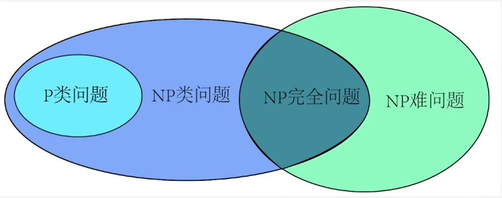

# NP-完全问题

可满足性问题SAT：给一个公式F，在真值表里面是否存在一行，让这个F为True，如果有，就是可满足的，否则是不可满足的、

SAT是NP问题

多项式：一元n次方程

时间复杂度：多项式时间复杂度和非多项式时间复杂度

约化：一个问题A可以约化为问题B，即可以用解决问题B的方法来解决问题A。例如A为一元一次方程，B为一元二次方程

P类问题：可在多项式时间内找到问题的正确解

NP类问题：可在多项式时间内验证一个解是否为正确解，但是不一定在多项式时间内找到问题的正确解

NP-hard问题：NP类问题可以在多项式时间内约化成问题B，B就是NP-hard问题

NPC问题：NP-hard和NP类问题的交集

2-SAT是P类问题

如何证明一个问题是NPC问题：

1. 证明问题属于NP问题，如果给定一个解，可以在多项式时间内验证这个解是否正确
2. 找到一个已知的NPC问题
3. 将已知的NPC问题归约到待证明的问题上，构建一个多项式时间内的规约，从已知的NPC问题到待证明的问题之间的转换
4. 证明规约的有效性
5. 得出结论

顶点覆盖问题(Vertex Cover Problem)是NPC问题：求点集，要求无向图中的每条边的两个顶点中至少有一个在该点集，求该点集最小的那个集
