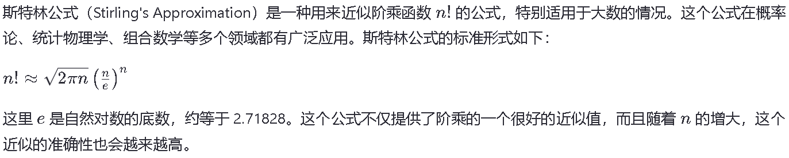
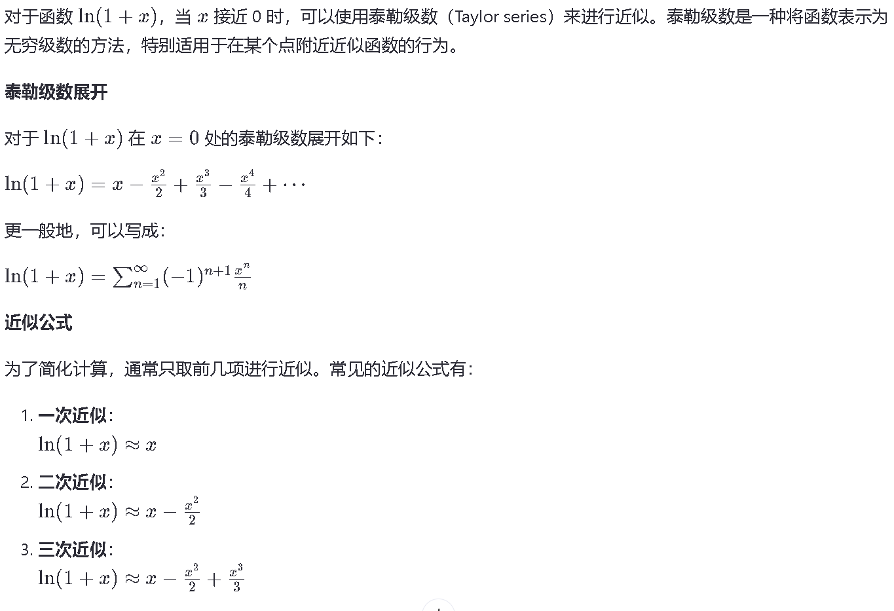

# 概率算法



用于生成随机数

```c++
 int random_pick(vector<pair<int, double>> nums_probs) {
 	int res;
 	random_device rd; //定义一个非确定性的真随机生成器
 	uniform_real_distribution<double> U(0, 1); //随机数分布对象
 	double x = U(rd); //在[0,1) 内随机选取实数作为x
 	double cumu_prob = 0.0; //初始化累积概率
 	for(auto num_prob : nums_probs) {
 		cumu_prob += num_prob.second;
 		if(x < cumu_prob) {
 			res = num_prob.first;
 			break;
 		}
 	}
 	return res;
 }
```



e的n次方表示为exp(x)


